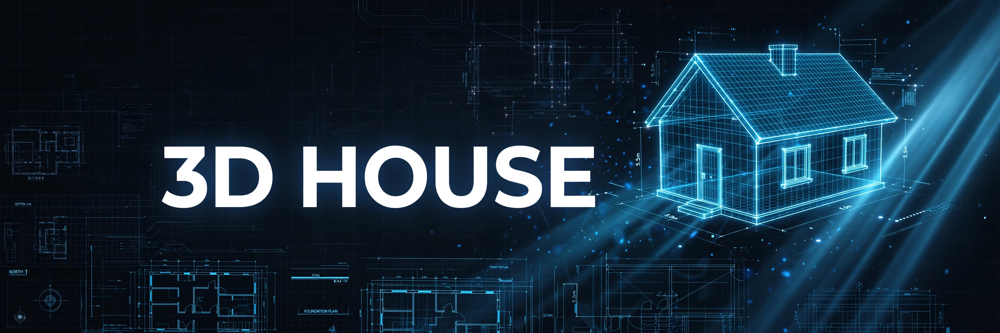
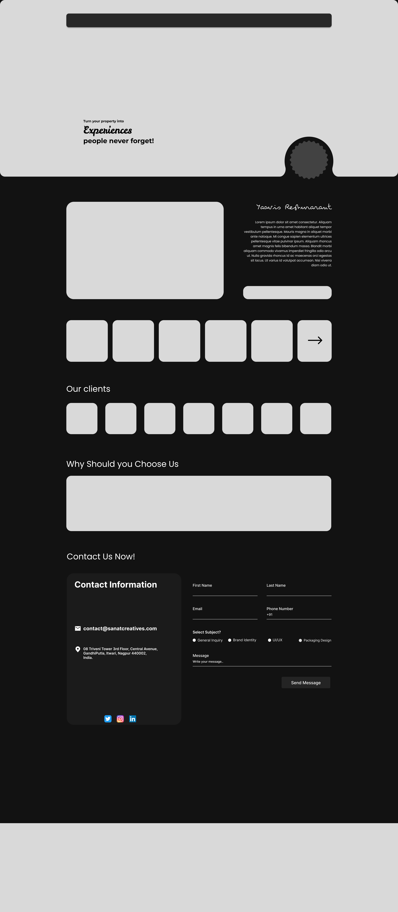

# 3D House

> ## Status: 🟢 Completed
>
> <progress value="90" max="100"></progress>
> **Progress: 90%** — Marketing site complete, builds cleanly, all sections present

<p align="center">
  
</p>

[](https://react.dev/)
[](https://vite.dev/)
[](https://motion.dev/)

## What it is

A marketing website for a 3D house visualization company — "turn your property into experiences people never forget". Single-page site with animated hero, project showcase, client testimonials, why-choose-us, and contact sections. Built for a real-estate/arch-viz business to present its portfolio.

## What works (verified)

- ✅ Project builds cleanly — `npm run build` succeeds (verified)
- ✅ All five sections render: Hero, Projects, Clients, WhyChooseUs, Contact (verified by reading `App.jsx`)
- ✅ Framer Motion scroll/entrance animations on hero and sections (verified by code read)
- ✅ Responsive layout with dedicated CSS (verified by code read)

## Tech stack

| Layer | Tech |
|---|---|
| Framework | React 19 + Vite 8 |
| Animation | Framer Motion 12 |
| Icons | lucide-react, react-icons |
| Styling | Plain CSS (`App.css`, `index.css`) |

## How to run

```bash
npm install
npm run dev      # dev server → http://localhost:5173
npm run build    # production build → dist/
```

## Screenshots



## What you can add more

- [ ] Contact form backend — the Contact section currently has no form submission wired up
- [ ] Real project gallery images instead of placeholders
- [ ] SEO meta tags and Open Graph images (currently minimal)
- [ ] Mobile nav menu — check the navbar collapses cleanly on small screens
- [ ] Page speed pass — the JS bundle is ~326 KB; code-split framer-motion if needed

## Project structure

```
src/
├── App.jsx               # Renders all five sections
├── main.jsx              # Entry point
├── components/
│   ├── Hero.jsx          # Animated hero with curved cutout
│   ├── Projects.jsx      # Project showcase
│   ├── Clients.jsx       # Client testimonials
│   ├── WhyChooseUs.jsx   # Value props
│   └── Contact.jsx       # Contact section
├── App.css / index.css   # Styling
```

---
*README written after code audit on 2026-10-08.*
